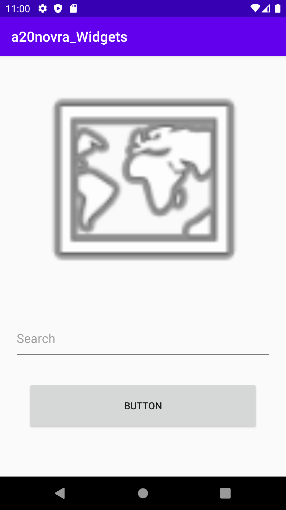

# Assignment 3: Widgets

** Rapport**

Efter att jag klonade forken från Github  jag valde lägga till en Linear Layout i activity_main.xml filen.

```
<?xml version="1.0" encoding="utf-8"?>
<LinearLayout xmlns:android="http://schemas.android.com/apk/res/android"
    xmlns:app="http://schemas.android.com/apk/res-auto"
    xmlns:tools="http://schemas.android.com/tools"
    android:layout_width="match_parent"
    android:layout_height="match_parent"
    tools:context=".MainActivity"
    android:orientation="vertical">

    <EditText
        android:id="@+id/myNewEdt"
        android:layout_width="match_parent"
        android:layout_height="62dp"
        android:layout_margin="20dp"
        android:hint="Search" />

   <Button
        android:id="@+id/button"
        android:layout_width="match_parent"
        android:layout_height="76dp"
        android:layout_marginStart="40dp"
        android:layout_marginTop="10dp"
        android:layout_marginEnd="40dp"
        android:text="Button" />

    <ImageView
        android:id="@+id/imageView"
        android:layout_width="match_parent"
        android:layout_height="314dp"
        android:layout_marginTop="20dp"
        android:layout_marginBottom="20dp"
        app:srcCompat="@android:drawable/ic_menu_mapmode" />


</LinearLayout>
```
Som ni kan se i koden ovan det är bara en tag med namnet LinearLayout I det  med några attribute liksom layout_width, layout_height och orientation.

På nästa steg jag har lagt tre olika widget på Linear Layouten och stylade de med margin top och bottom. Jag har bestämt deras höjd och bredden också. Jag kunde lägga en enkelt funktionalitet på knappen men på grund av det inte var något som uppgiften krävde så skippade det. Tänkte nämna att i början jag hade button i slutet och ändrade det sen på grund av uppgift beskrivningen att ändra position av widgets.


